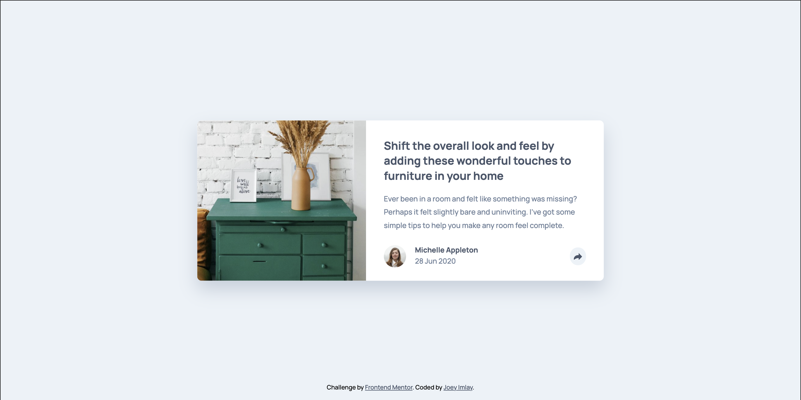

# Frontend Mentor - Article preview component solution

This is a solution to the [Article preview component challenge on Frontend Mentor](https://www.frontendmentor.io/challenges/article-preview-component-dYBN_pYFT). Frontend Mentor challenges help you improve your coding skills by building realistic projects.

## Table of contents

- [Overview](#overview)
  - [The challenge](#the-challenge)
  - [Screenshot](#screenshot)
  - [Links](#links)
- [My process](#my-process)
  - [Built with](#built-with)
  - [What I learned](#what-i-learned)
  - [Continued development](#continued-development)
  - [Useful resources](#useful-resources)
- [Author](#author)

## Overview

### The challenge

Users should be able to:

- View the optimal layout for the component depending on their device's screen size
- See the social media share links when they click the share icon

### Screenshot



### Links

- Solution URL: [https://www.frontendmentor.io/solutions/article-preview-solution-using-sass-UjokfRb8i](https://www.frontendmentor.io/solutions/article-preview-solution-using-sass-UjokfRb8i)
- Live Site URL: [https://dentednerd.github.io/fm-article-preview/](https://dentednerd.github.io/fm-article-preview/)

## My process

### Built with

- Semantic HTML5 markup
- Sass
- CSS custom properties
- Flexbox
- CSS Grid

### What I learned

I'm not convinced that the 13px font size specified in the style guide is correct. I settled on 13.25px in the end.

I used a lot of hardcoded measurements for widths, which I'm not proud of.

Animating the state change in the footer was the biggest challenge. The Javascript was pretty straightforward:

```js
function onClick() {
  var thisItem = document.getElementById('footer');
  thisItem.classList.toggle("active");
};
```

Positioning the hovering share section on desktop was tricky. Again, I had to hardcode a px measurement, which makes me feel all kinds of icky.

### Continued development

It's not fully responsive; I hardcoded two widths for the card. Animating the share section into view would be nice.

### Useful resources

- [Bubbler – CSS Speech Bubble Generator](https://www.ilikepixels.co.uk/bubbler/) - This helped me get the ::after element on the hovering share section correct.

## Author

- Website - [Joey Imlay](https://joeyimlay.dev)
- Frontend Mentor - [@dentednerd](https://www.frontendmentor.io/profile/dentednerd)
- Twitter - [@dentednerd](https://www.twitter.com/dentednerd)
